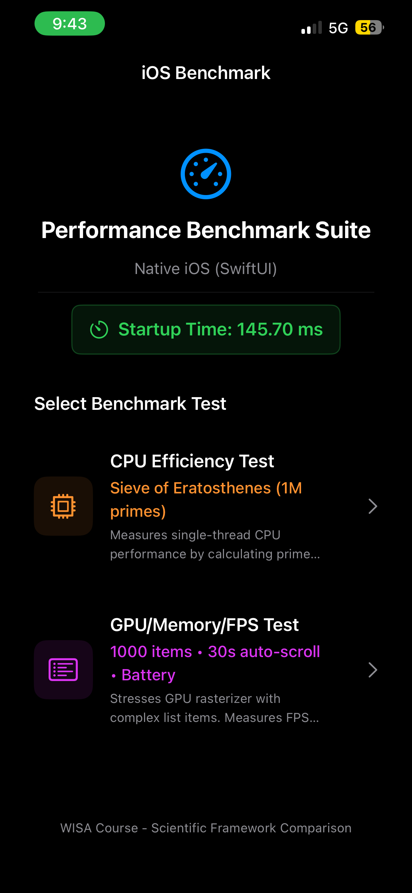
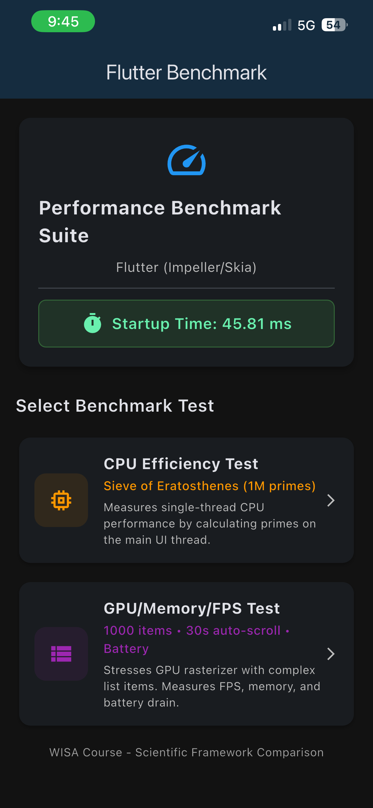

<!-- markdownlint-disable MD033 -->
<!-- markdownlint-disable MD041 -->
<p align="center">
  
  &nbsp;&nbsp;&nbsp;&nbsp;
  
</p>

<h1 align="center"> WISA Course - Scientific Framework Comparison</h1>

This benchmark suite provides an **apples-to-apples** performance comparison between:

- **Flutter** (Impeller/Skia rendering engine)
- **Native iOS** (SwiftUI)

---

## 📜 Documentation

- **[TECHNICAL.md](./TECHNICAL.md)** - Comprehensive technical details about benchmark methodology, implementation, measurement approaches, and results analysis
- **[Academic Paper](./documentation/paper.tex)** - Full scientific documentation in LaTeX

---

## 📊 Metrics Measured

| Metric | Description | Implementation |
| --- | --- | --- |
| **CPU Efficiency** | Single-thread performance | Sieve of Eratosthenes (1M primes) on main thread |
| **FPS Stability** | Frame rendering consistency | 1000-item list with 30s auto-scroll |
| **Memory (RAM)** | Memory allocator stress | Complex UI elements with gradients/shadows |
| **Battery Impact** | Energy consumption | Battery level delta during GPU test |
| **App Startup Time** | Time to Interactive (TTI) | main() → first frame rendered |

---

## 🖼️ Screenshots & Video Demo

Below are screenshots and video demos of the apps and their benchmark tests:

<!-- markdownlint-disable MD033 -->
<table>
  <tr>
    <th colspan="2">iOS App</th>
  </tr>
  <tr>
    <td align="center"></td>
    <td align="center"><video src="https://github.com/user-attachments/assets/c033d096-f238-4589-8359-758b44818096" controls width="250"></video></td>
  </tr>
  <tr>
    <th colspan="2">Flutter App</th>
  </tr>
  <tr>
    <td align="center"></td>
    <td align="center"><video src="https://github.com/user-attachments/assets/c06b7e6b-b978-41fb-bf92-5b504a8ada06" controls width="250"></video></td>
  </tr>
</table>
<!-- markdownlint-enable MD033 -->

---

## 🏗️ Project Structure

```text
Projects/
├── flutter_benchmark/                  # Flutter App
│   ├── lib/
│   │   ├── main.dart                   # Entry point + startup time measurement
│   │   ├── app.dart                    # App root & routing
│   │   ├── core/                       # Config, theme, utilities
│   │   ├── features/
│   │   │   ├── cpu_test/               # CPU benchmark screen & algorithm
│   │   │   ├── gpu_test/               # GPU/FPS/Memory/Battery test screen
│   │   │   └── home/                   # Home screen
│   │   ├── services/                   # Battery & memory MethodChannels
│   │   └── widgets/                    # Shared UI components
│   ├── ios/Runner/AppDelegate.swift    # Battery MethodChannel (native side)
│   └── pubspec.yaml
│
├── ios_benchmark/                      # Native iOS App (SwiftUI)
│   └── iOSBenchmark/
│       ├── iOSBenchmarkApp.swift       # Entry point + startup time measurement
│       ├── ContentView.swift           # Navigation
│       ├── CPUTestView.swift           # CPU benchmark
│       └── GPUTestView.swift           # GPU/FPS/Memory/Battery test
│
├── documentation/                      # Academic paper (LaTeX)
│   ├── paper.tex
│   └── refs.bib
│
├── screenshots/                        # App screenshots & demo media
├── presentation/                       # Presentation slides
├── README.md
└── TECHNICAL.md                        # Benchmark methodology & results analysis
```

---

## 🧪 Test Specifications

### Test 1: CPU Efficiency (Sieve of Eratosthenes)

**Purpose:** Measure raw single-thread computational performance.

| Parameter | Value |
| --- | --- |
| Algorithm | Sieve of Eratosthenes |
| Range | 2 to 1,000,000 |
| Expected Result | 78,498 primes |
| Thread | **Main UI Thread** (intentionally blocking) |
| Measurement | Execution time in microseconds |

**Scientific Rationale:** Running on the main thread tests how each framework handles CPU-bound tasks and measures UI freezing behavior.

---

### Test 2 & 3: GPU/Memory Stress (List Scroll Test)

**Purpose:** Stress the GPU rasterizer and memory allocator.

| Parameter | Value |
| --- | --- |
| List Items | 1,000 complex items |
| Item Content | Gradient backgrounds, shadows, tags, buttons |
| Auto-Scroll Duration | **30 seconds** (constant velocity) |
| Scroll Curve | Linear (identical velocity on both platforms) |

**Measurements:**

- **FPS:** Frame build times logged via `SchedulerBinding` (Flutter) / `CADisplayLink` (iOS)
- **Jank Detection:** Frames > 16.67ms (missing 60 FPS target)
- **Memory:** Monitored via Xcode Instruments / Flutter DevTools

---

### Test 4: Battery Impact

**Purpose:** Measure energy consumption during GPU stress.

| Parameter | Value |
| --- | --- |
| Method | Battery level % before/after 30s scroll |
| Implementation | `UIDevice.batteryLevel` (iOS) / MethodChannel (Flutter) |
| Output | Delta percentage (e.g., "Battery Drain: 1%") |

**Note:** Battery monitoring requires a **physical device**. Simulators return -1.

---

### Test 5: App Startup Time (TTI)

**Purpose:** Measure Time to Interactive.

| Event | Flutter | iOS |
| --- | --- | --- |
| Start | `main()` function called | `@main` app launch |
| End | `addPostFrameCallback` fires | `.onAppear` modifier |
| Measurement | Microseconds (μs) | Microseconds (μs) |

---

## 🚀 Running the Benchmarks

### Flutter App

```bash
cd flutter_benchmark

# Get dependencies
flutter pub get

# Run in release mode for accurate benchmarks
flutter run --release

# Or profile mode for Flutter DevTools
flutter run --profile
```

### iOS App

1. Open `ios_benchmark/iOSBenchmark.xcodeproj` in Xcode
2. Select a physical device (for battery metrics)
3. Build & Run (⌘R)
4. For performance profiling, use **Product → Profile** (⌘I)

---

## 📈 Interpreting Results

### Console Output

Both apps print detailed logs:

```text
═══════════════════════════════════════════════
FLUTTER BENCHMARK - CPU TEST RESULTS
═══════════════════════════════════════════════
Algorithm: Sieve of Eratosthenes
Limit: 1000000
Primes found: 78498
Execution time: 45230 μs
Execution time: 45.23 ms
═══════════════════════════════════════════════
```

### Key Metrics to Compare

| Metric | Good | Acceptable | Poor |
| --- | --- | --- | --- |
| CPU Time | < 50ms | 50-100ms | > 100ms |
| Jank Rate | < 1% | 1-5% | > 5% |
| Est. FPS | ≥ 58 | 50-58 | < 50 |
| Avg Frame Time | < 16.67ms | 16.67-33ms | > 33ms |

---

## 🔬 Scientific Controls

To ensure valid comparison:

1. **Same Device:** Run both apps on the same physical device
2. **Same Conditions:** Close background apps, same battery state
3. **Release Builds:** Use release/production builds for both
4. **Multiple Runs:** Run each test 5+ times and average results
5. **Cool-Down Period:** Wait 1-2 minutes between tests to prevent thermal throttling

---

## 📱 Requirements

### Flutter

- Flutter SDK 3.10+
- Dart 3.0+
- iOS 12.0+ / Android API 21+

### iOS Native

- Xcode 15.0+
- iOS 17.0+
- Swift 5.9+

---

## 📝 License

MIT License - WISA Course Project
